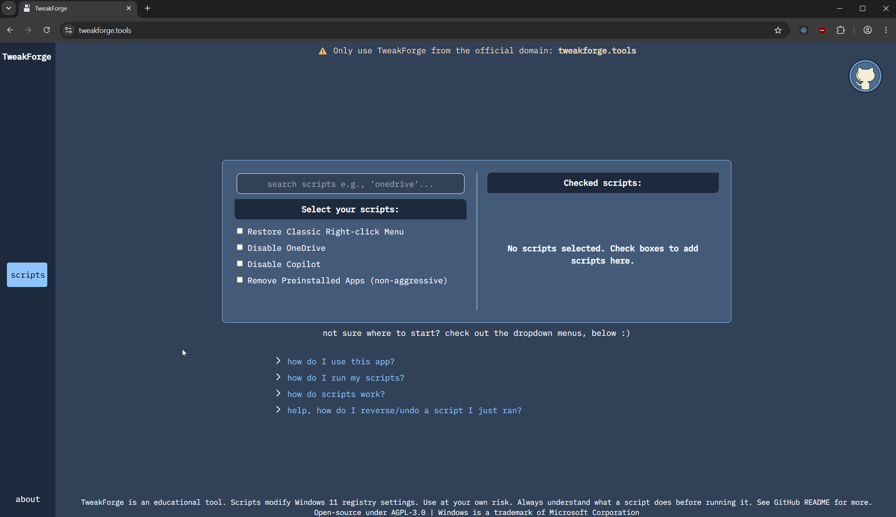
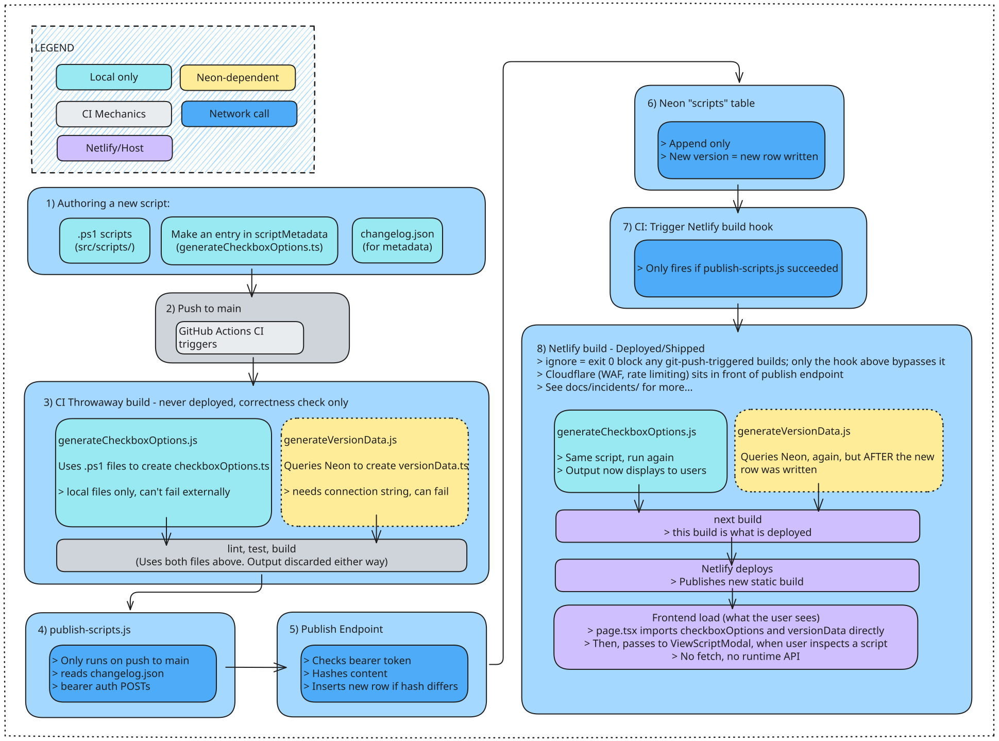

# TweakForge

Customise Windows 11 e.g., disable OneDrive, through browser-based registry scripts - no account or installation required.

## Motivations
- **Safety:** no longer need to rely on CLI tweak apps that use unsafe pipe operations. You only (manually) run, what you want, done in seconds
- **Transparency:** scripts are laid bare within the app itself (check the modals), and at `src/scripts`
- **Ease of use:** no need to memorise every feature/registry edit you need for existing setups and fresh Windows 11 installations
- **User friendly and educational:** full instructions on script execution, plus safety features and explanations within each script - scripts will not immediately run without explicit confirmation
- **Reversibility:** all scripts where possible, have reverse scripts in case you change your mind
- **Script validation:** scripts are tested in virtual machines and in a standardised environment, via a differencing disk strategy. See [Script Testing Methodology](#script-testing-methodology-via-differencing-disk) for more

Note: TweakForge started as a vehicle to practice production patterns, so some features may seem overkill.

**Try it now:** https://tweakforge.tools/

<p align="center">
  
</p>

### Built With
- **Frontend:** Next.js + TypeScript + Tailwind + Jest
- **Backend:** Neon Serverless (PostgreSQL) + Next.js App Router + Node.js + TypeScript + JavaScript
- **CI:** GitHub Actions
- **Infrastructure:** Netlify (hosting + deploys) + Cloudflare (WAF + rate limiting) + Docker

## Table of Contents
- [Key Features](#key-features)
- [Architecture Decisions](#architecture-decisions)
- [Backend & Script Versioning](#backend--script-versioning)
- [Local Development](#local-development)
- [Script Testing Methodology](#script-testing-methodology-via-differencing-disk)
- [Safety & Transparency](#safety--transparency)
- [Contributing](#contributing)
- [Project Status](#project-status)
- [License](#license)

## Key Features

- **Zero-friction onboarding:** No account creation required; immediate access to all functionality
- **Accessibility-first design:** Full keyboard navigation support and beginner-friendly interface
- **Privacy-focused:** No advertisements, tracking, or data collection
- **Safety net:** Scripts are temporarily disabled if issues are identified
- **Resilience:** Elimination of endpoint vulnerabilities via build-time static generation - see `docs/incidents/scraper-spike-2026.md` for more on the bot-driven traffic spike event (195k requests/month vs a 300/day baseline)

## Architecture Decisions
<p align="center">

</p>

- Every push runs 2 builds: Steps 1-3 are throwaway correctness checks that are always discarded. This may be improved at a future date
- The real deploy only happens after Step 5 writes to Neon, which triggers the second build in Step 8, which is what's shipped

## Backend & Script Versioning

### Why everything is static
- A live database dependency (for non-corporate software) means: cold starts, connection limits, an outage taking features down with it. None of that should stand between a user and a registry script
- So, neither scripts nor metadata are ever fetched at runtime. Both are baked in at build time - scripts from local files, metadata from a Neon query. And the deployed app never talks to a database when someone's using it
- If a metadata fetch is missed at build time (say, a Neon hiccup), a script's metadata just says "not yet published" - TweakForge itself never goes down over it
- Scripts are never stored in or served from the database. A compromised database affects the changelog display only, not script integrity

### Endpoint
- `/api/scripts/publish` -> Private. CI POSTs here with a bearer token after a successful publish step; the endpoint hashes and compares content before writing a new version row to Neon
- Checks whether a script changed since the last push, and if so, writes a new version
- Cloudflare WAF and rate limiting are active to prevent further endpoint incidents. See `docs/incidents/scraper-spike-2026.md` for more

### CI Integration
- `ci.yml` runs on every PR and every push to `main`: install, generate static files (needs a Neon connection string secret), lint, test, build, then confirm the Dockerfile still builds. Nothing here is deployed, it's a correctness gate only
- On a push to main, once the gate above passes, `publish-scripts.js` POSTs script content to the private publish endpoint with a bearer token
- If publish succeeds, CI fires the Netlify build hook. That's the only way a real deploy happens. A Netlify `ignore = exit 0` setting blocks Netlify's own git-push-triggered builds, so nothing ships except through this hook

## Local Development
- Metadata generation needs a Neon connection string in `.env.local` to show real version/changelog data locally (might be streamlined in a future fix)
- Without it, the app runs fine: scripts just show as "not yet published"
- To work with real version data locally: point `NEON_CONNECTION_STRING` in `.env.local` at your own Postgres instance and run `migrations/001_create_scripts.sql` against it

### Prerequisites
- **Option 1:** Node.js v22.11.0 or higher
- **Option 2:** Docker Desktop

<br>

<details>
<summary><b>Option 1: Setup Instructions (Node.js)</b></summary>

```bash
# Clone the repository
git clone https://github.com/Deen-q/tweakforge.git
cd tweakforge

# Install dependencies and start development server
npm install
npm run dev

# Application runs at http://localhost:3000 with hot module replacement enabled
```

</details>

<details>
<summary><b>Option 2: Setup Instructions (Docker)</b></summary>

```bash
# Clone the repository
git clone https://github.com/Deen-q/tweakforge.git
cd tweakforge

# Build the Docker image
docker build -t tweakforge .

# Run the container (note the --name flag)
docker run -d -p 3000:3000 --name tweakforgecontainer tweakforge

# Access the application at http://localhost:3000

# Stop the container
docker stop tweakforgecontainer

# Optional: Remove the container
docker rm tweakforgecontainer

# Note: Docker doesn't auto-reload like Node.js HMR - rebuild the image after making changes
```

</details>

<br>

<details>
<summary><b>Help, I'm new to Docker</b></summary>

### Understanding the Run Command

**`docker run -d -p 3000:3000 --name tweakforgecontainer tweakforge`**

- **`docker run`** - Create and start a new container from an image
- **`-d`** (detached mode) - Run in background, freeing up your terminal
- **`-p 3000:3000`** (port mapping) - Forward `localhost:3000` → container port `3000`
- **`--name tweakforgecontainer`** - Give the container a human-readable name
- **`tweakforge`** - The image name to run (created with `docker build`)

### Common Commands

```bash
# Control your container
docker stop tweakforgecontainer
docker start tweakforgecontainer
docker restart tweakforgecontainer
docker rm tweakforgecontainer  # Remove (must stop first)

# Monitor containers
docker ps                        # Show running containers
docker ps -a                     # Show all containers (including stopped)

# View logs
docker logs tweakforgecontainer          # View logs
docker logs -f tweakforgecontainer       # Follow logs in real-time

# Debugging
docker exec -it tweakforgecontainer sh   # Access container shell
```

### Rebuild After Changes

```bash
docker stop tweakforgecontainer
docker rm tweakforgecontainer
docker build -t tweakforge .
docker run -d -p 3000:3000 --name tweakforgecontainer tweakforge
```

</details>
<br>

**Development Workflow:**
- Create a new branch for your changes before beginning work
- Use the Node.js setup for active development (instant feedback)
- Use Docker to test the production build
- Run `npm run fulltest` before pushing any changes

## Script Testing Methodology (via differencing disk)

Scripts undergo validation in isolated Windows environments before merging to the main branch. The testing process uses Hyper-V virtual machines with a differencing disk strategy:

**Infrastructure:**
- **Base Image** – Clean Windows installation with read-only parent disk serving as immutable template
- **Differencing Disks** – Lightweight, test-specific disks that capture only changes from the base image
- **Test Workflow** – Boot VM → Execute script → Validate results → Discard differencing disk → Generate fresh disk for next iteration
- **Benefits** – Ensures consistent test environment while maintaining rapid iteration speed (differencing disks typically <5GB vs. multi-GB snapshots)

See [differencing disk methodology](docs/differencing-disk-methodology.md) for full details.

## Safety & Transparency

- All scripts are open-source and reviewable in `/src/scripts`
- Scripts require administrator privileges to modify system settings. Please don't overlook the `Ctrl + Shift + Enter` step under "How do I run my scripts?" in the app itself
- Despite all the care put into the scripts, it is still recommended you either backup your entire registry or create a system restore point before applying changes

## Contributing

Contributions welcome! Please:
1. Open an issue to discuss proposed changes
2. Fork the repository and create a feature branch
3. Ensure everything passes (`npm run fulltest`)
4. Submit a pull request with clear description

### Potential areas for improvement
- Increasing unit test coverage
- Implementing integration test suite (likely Cypress)
- Expanding script library (or just suggest ones you'd like)
- Improving the "Contribution" documentation

Reminder: concerning the need for a connection string, see [Local Development](#local-development)

## Project Status
- TweakForge will be receiving significantly fewer updates as I work on other projects

## License

[GNU AFFERO GENERAL PUBLIC LICENSE Version 3 (AGPL-3.0)](LICENSE)